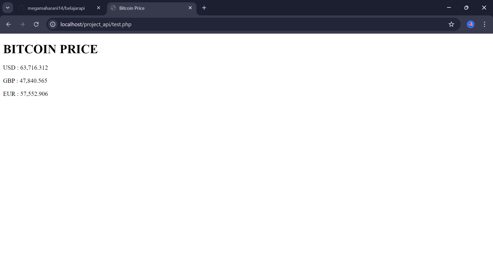

Praktikum 
1.untuk mengirim data ke server

2.untuk mengambil data menggunakan file_get_contents:

Tugas Praktikum API dengan PHP

1.Metode get 
untuk mengambil data dari server tanpa mengubah data

2.Metode post
untuk mengirim data ke server

3.Metode delete
untuk menghapus data dari server

Tugas Praktikum
1.Konsumsi data dengan get request

mengambil data dengan get request, respons array php dan menampilkan lima elemen dari data.

2.Mengirim data dengan post reguest

mengirimkan data baru post request dan menampilkan respons dari server 

3.Menghapus data dengan delete request

curl_error untuk menampilkan kesalahan
kode status http akan menampilkan status dan respons dari server hasil request seperti 200 untuk sukses.

Analisa Metode HTTP
1.perbedaan antara metode GET, POST dan DELETE
metode get digunakan untuk mengambil data dari server, parameter yang digunakan ditambahkan ke url dalam bentuk query string.

Metode post digunakan untuk mengirim data ke server, data yang dikirim diletakkan dalam body.

Metode delete digunakan untuk menghapus data dari server berdasarkan idnya, id sumber ditambahkan ke url.

2.Diskusikan skenario kapan harus menggunakan masing-masing metode dalam aplikasi nyata.

Penggunaan metode get ketika menampilkan daftar produk saat membuka aplikasi e-commerce.

Penggunaan metode post ketika membuat akun.

Penggunaan metode delete ketika menghapus produk dari keranjang belanja.